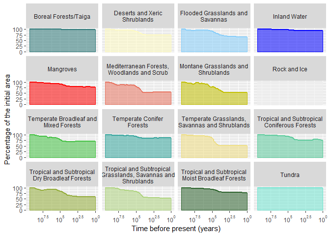

# Spatial dynamic of the biomes through the Holocene

While organizing a workshop on the impact of human activities on biodiversity at different spatial
scales, I realized that a good entry point would be to illustrate how some physical features of
the environment (for example biome area, as defined as the area of a biome not being covered by land-use) 
have changed through time.
What is presented is a walkthrough on the process used to generate biome extent maps through time and the visual representation of it. The code (functions and analyses scripts) is available [here](https://github.com/vpellissier/holocene_biomes_dynamics) and the data generated are downloadable [here]()

## The historical land-use dataset
The HYDE 3.2 dataset is a well-known reconstruction of past land-use (from the beginning of the Holocene to present day). For each time point the percentage of each cell being cropland (divided into irrigated and rain-fed non-rice crops and irrigated and rain-fed rice crops) or grazing land (divided into intensive pasture and less intensive rangeland) is modelled based on population estimates. The whole data set comprises 67 series of maps: for each time point, a map for each of the above land-cover was produced. In addition, at each time point, three different population estimate are used (lower, median and upper)

## Outputs
I had two visual outputs in mind. (1) A series of chronological maps showing the variation of the extent of each biome through time and (2) a temporal graph of the total area for each biomes.

## Methods
### Downloading and extracting maps
On the HYDE website, maps are downloadable either one by one (that is, for each point in time, one has to select the desired population scenario, format, date and type of land-cover) or in bulk (that is, on .zip file per date).
Neither of these options is really practical. The first one implies clicking on each map, one by one. The second one implies extracting the maps from the zipfile, either one by one, or autocmatically (and having more information that is really needed).
To overcome that issue, I designed a function (compute_non_human()) that computes for a given point in time and for each biome, the percentage of each cell NOT covered by a human land-cover (i.e. cropland and grazing land) and saves it on a local computer.  

#### Download and computation algorithm
The code in the function is commented, but what follow is a brief description of the algorithm and the code used to run the function:

* The function takes several arguments:
    + 'date' is the date for which we want information,  
    + 'scenario' matches the population scenario ('upper', 'lower' or 'median')  
    + 'path_save' is the local path where the maps are saved    
    + raster_biomes' is a  raster containing biome information. It matches the biomes shapefile found             [here](https://www.worldwildlife.org/publications/terrestrial-ecoregions-of-the-world). The biomes raster can be downloaded [here](https://github.com/vpellissier/holocene_biomes_dynamic/raw/master/Original%20data/biomes.tif)
    
  
* The function proceed as follow:  
    + It calls a subfunction (dl_land_use()) which download a raster of a land-cover for a given date in a temporary folder This sub-function is called three time (to download raster for cropland, rangeland and pastures). This webscrapping approach requires one extra-step, explained in more detail below.
    + The 3 rasters are loaded in the R environment and added together, in order to create a human land-cover layer.
    + For each given biome in the raster, the percentage of each cell belonging to this biome and NOT being human land-cover is computed.
    + The output is saved as a stacked raster (one layer per biome) and the temporary folder is removed from the local computer
    
#### Compiling raster of non human land-cover
First, one need to download the biome raster in a folder (here, I use a temporary folder) and the accompanying XML file.


```r
library(raster, quietly = T, warn.conflicts = F)
library(snowfall, quietly = T, warn.conflicts = F)
require(dplyr, quietly = T, warn.conflicts = F)
library(tibble, quietly = T, warn.conflicts = F)
library(rasterVis, quietly = T, warn.conflicts = F)
library(ggplot2, quietly = T, warn.conflicts = F)
library(tidyr, quietly = T, warn.conflicts = F)

# Downloading the biomes raster
tp <- tempdir()
raster_url <- "https://github.com/vpellissier/holocene_biomes_dynamic/raw/master/Original%20data/biomes.tif"
xml_url <- "https://github.com/vpellissier/holocene_biomes_dynamic/raw/master/Original%20data/biomes.tif.aux.xml"
download.file(raster_url, file.path(tp, "biomes.tif"), mode = "wb")
download.file(xml_url, file.path(tp, "biomes.tif.aux.xml"), mode = "wb")
raster_biomes <- raster(file.path(tp, "biomes.tif"))
```
    
Prior to actually downloading the data, a Selenium server have to be started, in order for R to be able to command a web-browser (here Chrome).
There is several ways to do this, but here we are going to use a standalone server.
THe server can be downloaded from the [Selenium Project](http://selenium-release.storage.googleapis.com/index.html).
Once downloaded, the server can be started using the following command line (either in Windows shell or in RStudio Terminal):

`> java  -jar path/file_name`

Where path is the path were you have downloaded the file, and file the name of the file (should end with a .jar extension).
Then, the data can actually be downloaded and processed for the 66 dates available in the HYDE dataset (unfortunately, dates had to be copied manually)


```r
dates <- c("10000BC", "9000BC", "8000BC", "7000BC", "6000BC", "5000BC", "4000BC", "3000BC",
           "2000BC", "1000BC", "0AD", "500AD", "1000AD", "1100AD", "1200AD", "1300AD", "1400AD", 
           "1500AD", "1600AD", "1700AD", "1710AD", "1720AD", "1730AD",   "1740AD", "1750AD", 
           "1760AD", "1770AD", "1780AD", "1790AD", "1800AD", "1810AD", "1820AD", "1840AD", 
           "1850AD", "1860AD", "1870AD", "1880AD", "1890AD", "1900AD", "1910AD", "1920AD", 
           "1930AD", "1940AD", "1950AD", "1960AD", "1970AD", "1980AD", "1990AD", "2000AD", 
           "2001AD", "2002AD", "2003AD", "2004AD", "2005AD", "2006AD", "2007AD", "2008AD", 
           "2009AD", "2010AD", "2011AD", "2012AD", "2013AD", "2014AD", "2015AD", "2016AD")

stacked_raster_path <- "path/to/stacked_raster_folder"

for(time_point in dates){
        try(compute_non_human(date, "upper", 
                      raster_biomes, 
                      save_path = stacked_raster_path))
}
```

The code presented above takes a couple of hours to finish, but the result of the code (the data processed and saved as stacked raster) can be found and downloaded in [this folder](https://goo.gl/aHhtGx)

### Mapping the biome extent through time
Here, in order to make the respresentation clearer, only the cells with less than 50% of their areas as human land-cover are considered as belonging to the biome.
While representing the cells with less than 50% of their areas as human land-cover can be done straight away with ggplot, here, I also produced raster map that could be used in subsequent analyses (the maps are stored [here]():


```r
## # Creating a dataframe matching biomes names and numeric code (embedded in the biome raster)
biomes_codes <- attr(raster_biomes@data, "attributes")[[1]]
## 
## # Creating maps of biome extent (one map per date and per biome, stored in separate directories)
## stacked_raster_path <- "path/to/stacked_raster_folder"
## biomes_extent_path <- "path/to/temporal_extent_biomes_folder"
## rasters <- dir(stacked_raster_path)
## 
## 
## sapply(seq(16), function(biome_value){
##     biome_name <- biomes_codes$category[biomes_codes$ID == biome_value]
##     biome_path <- file.path(biomes_extent_path, biome_name)
##     
##     if(!dir.exists(biome_path))
##         dir.create(path = biome_path)
## 
##         sapply(rasters, function(r){
##             r_date <- raster(file.path(stacked_raster_path, r), band = biome_value)
##             values(r_date)[values(r_date) < 0.5] <- 0
##             d <- gsub("biomes_", "", r)
##             d <- gsub(".tif", "", d)
##             writeRaster(r_date, 
##                         file.path(biomes_extent_path, biome_name, paste0(biome_name, "_", d, ".tif")))
##     })
## })
```

To illustrate the evolution of the temporal extent of biomes, only a few stapple date are represented but the rasters are computed for all the dates. Here, only the Temperate grassland and the Temperate forests are represented:


### Temporal evolution of biomes area through the Holocene
Once the stacked raster containing have been produced for each date, the total area is computed for each biome at each point in time.  
While compiling the stacked raster in not so computationnaly intensive (a few hours), compiling the area of non human land-cover in each cell, for each biome and at each time point is computationnally intensive.  
In order to fasten the process, it can be parallelized (here on a single machine)


```r
# creating a dataframe matching biomes names and numeric code (embedded in the biome raster)

# Assuming that the stacked raster are stored in "path/to/stacked_raster_folder"
stacked_raster_path <- "path/to/stacked_raster_folder"

rasters <- dir(stacked_raster_path)

# Compiling the area of non human land-cover in each pixel for each biome at each time point
sfInit(parallel=TRUE, cpus=6)
sfExport("raster")
df_area_biomes <- sfAapply(rasters, function(r){
                    raster_area <- area(raster(file.path(raster_path, r)))
                    sapply(seq(16), function(layer){
                        biomes_area <- raster(file.path(raster_path, r), band = layer) * raster_area
                        sum(biomes_area[], na.rm = T)
                        })
                    })
```


```r
# Adding biome names as rownames
rownames(df_area_biomes) <- as.character(biomes_codes$category[-1])

df_area_biomes <- apply(df_area_biomes, 2, function(x){
                        x / df_area_biomes[,grep("10000BC", colnames(df_area_biomes))] *100
                        })


# Transforming the data in long table and adding a year column (using 2016 as present date)
# and removing Mangrove, Waters, Rock and Montane grasslands
df_area_long <- as.data.frame(t(df_area_biomes)) %>%
                    rownames_to_column(var = "year_AD_BC") %>%
                    gather(Biome, Area, -year_AD_BC) %>%
                    mutate(year_AD_BC = gsub("biomes_", "", year_AD_BC)) %>%
                    mutate(year_AD_BC = gsub(".tif", "", year_AD_BC)) %>%
                    mutate(AD_or_BC = substr(year_AD_BC, nchar(year_AD_BC) - 1, nchar(year_AD_BC ))) %>%
                    mutate(year_BP = as.numeric(substr(year_AD_BC, 1, nchar(year_AD_BC) - 2))) %>%
                    mutate(year_BP = year_BP * ifelse(AD_or_BC == "BC", -1, 1) - 2017)# %>%
```

The area of each biomes at each time point is expressed as a percentage of the maximum area of each biome (that is to say at 10000BC, Figure 3)
<div class="figure" style="text-align: center">

<p class="caption">Figure 3. Temporal evolution of biomes area. The biome area for any given point in time is calculated as the sum of cells area not covered by human land-cover, as extracted from the HYDE 3.2 dataset</p>
</div>
